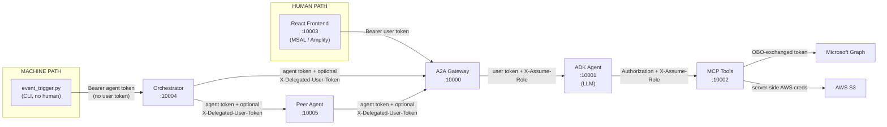
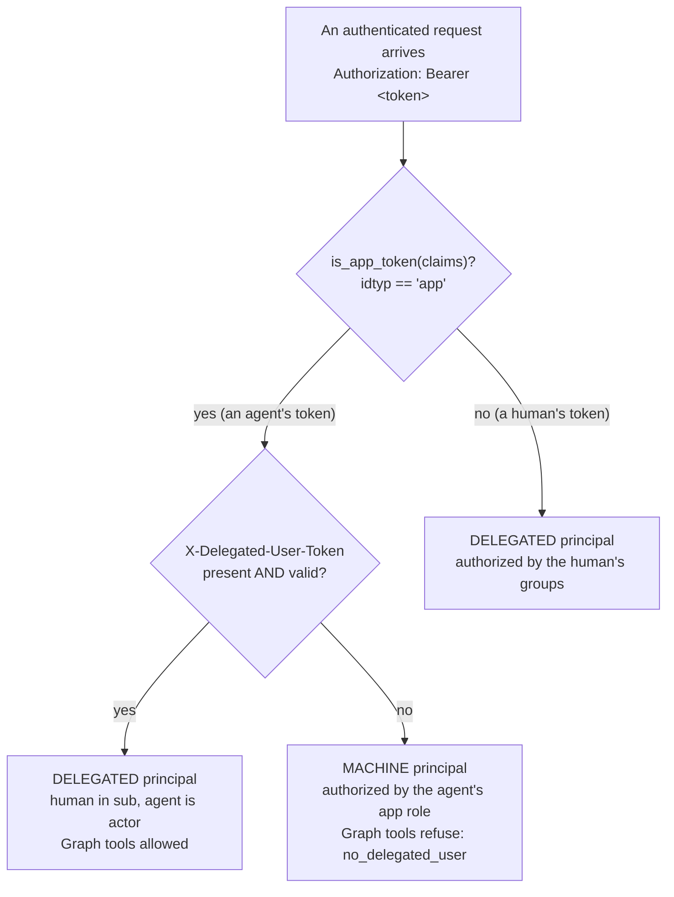

# Act 00 — The Big Picture

**Needs:** nothing. No services, no login. Do this one first, on the couch.

**Goal of this act:** get the whole system into your head as one idea and one diagram, then
prove your checkout is healthy by running the unit suite.

---

## The one idea

> **Every request carries proof of who is asking, and every layer re-verifies that proof
> itself instead of trusting the layer before it.**

That's it. Everything below is detail hanging off that sentence. Two phrases are worth
burning in:

- **No hop trusts a hop it cannot see.** The MCP server doesn't trust the agent that called
  it; the peer doesn't trust the orchestrator that called it. Each re-checks the token from
  scratch. That's why the same validation code appears to be "duplicated" across services —
  the *checks* are deliberately independent; only the *code performing them* is shared (in
  `agent_common/`).
- **Principal type is derived, never declared.** Nobody sends a field that says "I'm a human"
  or "I'm a machine." The system works it out from which tokens are present. You cannot lie
  about something you were never asked.

---

## The map

Six services. Three access-control gates. Two kinds of caller.



*(Source: [`assets/request-flow.mmd`](assets/request-flow.mmd).)*

**The three gates**, each owned by a different service, each denying for a different reason:

| Gate | Lives in | Asks | Denies when |
|------|----------|------|-------------|
| **1 — Agent** | A2A Gateway (:10000) | May this principal enter at all? | bad signature, blocked user, wrong group / missing app role |
| **2 — Tool** | MCP Server (:10002) | May this role use this tool? | the role isn't permitted for the tool |
| **3 — Resource** | Graph / S3 | May this token touch this data? | token lacks the scope, or IAM denies |

Three gates with three different owners is the entire "defense in depth" claim, made real:
a bug that opens one gate doesn't open the other two, because a different service enforces
each one against its own copy of the rules.

---

## Two kinds of caller

The left edge of the map has two entry points, and which one starts the request decides
what kind of *principal* travels through it:



*(Source: [`assets/principal-derivation.mmd`](assets/principal-derivation.mmd).)*

- **Delegated** — a human is behind the call. Authorized by *the human's* role (their groups
  map to a role). Graph tools work, because there's a real person to act on behalf of.
- **Machine** — an event started it, no human anywhere. Authorized by *the agent's* role (its
  app id maps to a role). Graph "on behalf of a user" tools correctly refuse — there's nobody
  to be on behalf of.

You'll build and watch both chains yourself in Acts 05 and 06.

---

## 0.1 — What each act needs from your environment

You don't need everything configured to start. Here's what each act actually touches:

| Acts | Needs |
|------|-------|
| 00 | nothing |
| 01–03 | the four human-path services running + a working Entra login (see [`../../TESTING.md`](../../TESTING.md)) |
| 04–08 | the above **plus** the one-time agent-tier tenant-admin setup (Act 04) |
| 09 | a configured Cognito user pool |

The environment variables live in `.env` (backend) and `frontend/.env`. Full setup is in
[`../../TESTING.md`](../../TESTING.md) and [`../../README.md`](../../README.md) — this
walkthrough won't repeat it. Two things to know so they don't trip you up later:

- The LLM key variable is **`AWS_BEARER_TOKEN_BEDROCK`** (a ~12-hour Bedrock token). If a doc
  or your memory says `ANTHROPIC_API_KEY`, that's stale — the code doesn't read it.
- `ENTRA_CLIENT_SECRET` is only needed for the Graph "on behalf of" (OBO) tools. Without it,
  Graph tools fall back to token claims or return an informative error; everything else works.

---

## 0.2 — The auth bypass (know it exists; you won't need it yet)

For demos without a real login, each server can skip auth. Copy `dev_config.example.toml` to
`dev_config.toml` (gitignored) and set `disable_auth = true` under the servers you want to
bypass, then restart them:

```toml
[a2a]
disable_auth = false
[adk]
disable_auth = false
[mcp]
disable_auth = false
default_role = "admin"          # the mock identity used when auth is off
default_email = "dev@localhost"
default_provider = "entra"
default_scopes = ["User.Read", "Files.Read", "Mail.Send", "Files.ReadWrite.All"]
```

We'll test **with real auth on** throughout — the point is to watch the gates work — but it's
worth knowing this exists for when you want to demo the UI without a tenant.

---

## 0.3 — Prove the checkout is healthy: run the unit suite

This needs no services and no login. From the repo root:

```bash
uv run pytest tests/ -m "not integration" -q
```

**Expected output** — the last line is what matters:

```
=== 16 failed, 169 passed, 44 skipped, 14 deselected, 12 warnings in ~57s ===
```

Read that carefully, because "16 failed" is the **healthy** result on a bare checkout:

- **169 passed** — the security logic: signature verification, forged-token rejection,
  fail-closed paths, principal derivation, role resolution, the OBO cache. This is the real
  proof the system's rules hold.
- **16 failed** — all in `tests/test_access_control.py` and `test_security_dashboard.py`.
  These are *live-server* tests: they try to connect to a running gateway/MCP and get
  connection errors because nothing is running. Documented as expected in `CLAUDE.md`. When
  you have the services up (Act 01), these can pass too.
- **14 deselected** — the integration tests (`-m integration`), which need the real tenant.
  You'll run these in Act 07.

If you see a number *other* than 169 passed, something in the security core is actually
broken — that's worth stopping for.

**Read the code:** the marker split is declared in `pyproject.toml` (`markers = [...]`); the
"expected connection errors" note is in `CLAUDE.md` under **Running Tests**.

---

## Architecture decision — why three independent gates

**What was chosen:** three access-control checks, in three different services, each against
its own copy of the policy.

**The alternative:** one gate. Check identity once at the front door, and let everything
behind it trust that check. Simpler, less code, one place to reason about.

**Why not:** a single gate makes every service behind it a soft target. If the ADK agent is
compromised, or someone finds a way to call the MCP server directly, a
"we already checked at the door" design hands them every tool. With independent gates, an
attacker who gets past Gate 1 still faces Gate 2 with no role, and Gate 3 with no scope.

**The trade-off you're accepting:** the same identity is validated more than once per
request (some latency), and the validation code has to be shared carefully so the three
gates don't quietly drift apart. This repo pays that cost deliberately — the shared code
lives in `agent_common/`, while the *decisions* stay separate on purpose. That tension —
share the code, duplicate the check — is the single most important design idea in the
codebase, and you'll see it enforced everywhere.

---

> ### Checkpoint — Act 00
> **You have now proven:** your checkout's security core is intact (169 passing), and you
> understand why the 16 failures are expected.
>
> **You now understand:** the one rule (every layer re-verifies), the six services, the three
> gates and who owns each, and that principal type is derived from tokens rather than declared.
>
> **Explain it in one sentence:** *"It's defense in depth done literally — three services each
> re-check who you are against their own rules, and whether you're a human or a machine is
> worked out from your tokens, never taken on your word."*

Next: [Act 01 — the golden thread](01-golden-thread.md). Start the services and watch one real
request cross all three gates.
