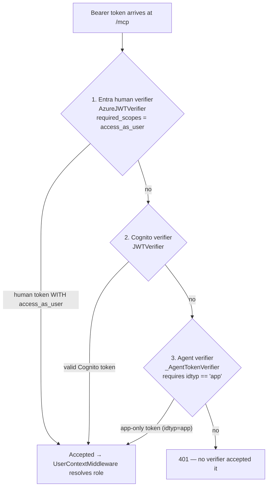

# Act 03 — MCP Security Up Close

**Needs:** the same four services and login as Act 01.

**Goal of this act:** stop going through the frontend and talk to the **MCP server directly**.
You'll prove it doesn't trust the agent that normally calls it, see exactly how it's secured
today (bearer JWT, several verifiers in a deliberate order), understand the honest trade-offs
versus the alternatives (a static API key; the MCP spec's OAuth 2.1 + PKCE + Dynamic Client
Registration), and see the one real gap that this design leaves open.

This is the act where "no hop trusts a hop it cannot see" stops being a slogan and becomes
something you can poke with `curl`.

---

## 3.1 — Attack the MCP server directly

The MCP endpoint is `http://localhost:10002/mcp` — a stateless streamable-HTTP endpoint. The
ADK agent normally calls it, but nothing stops *you* from calling it. That's the point: MCP
must defend itself, because in a real deployment the network is not a trust boundary.

**No token → refused.** An MCP call needs a session-initialising `initialize` request. Send
one with no `Authorization` header:

```bash
curl.exe -s -i -X POST http://localhost:10002/mcp \
  -H "Content-Type: application/json" \
  -H "Accept: application/json, text/event-stream" \
  -d '{"jsonrpc":"2.0","id":1,"method":"initialize","params":{"protocolVersion":"2024-11-05","capabilities":{},"clientInfo":{"name":"probe","version":"0"}}}'
```

**Expected:** an HTTP **401**. No token, no entry — the request never reaches a tool.

**Garbage token → refused.** Same call with `-H "Authorization: Bearer not-a-real-token"` →
still **401**. The token fails signature verification against the provider JWKS; a
made-up string has no valid signature.

**A real token → accepted.** Take the admin token you copied in Act 01, and add both
`-H "Authorization: Bearer $TOKEN"` and `-H "X-Assume-Role: admin"`. Now the `initialize`
succeeds and you can go on to `tools/list`. You just did, by hand, what the ADK agent does on
every call — and the MCP server treated your call exactly as it treats the agent's, because
it re-verifies from scratch either way.

**What you've proven:** the MCP server does not trust the ADK agent. It re-validates the
token itself. If the agent were compromised and tried to call a tool with a forged or absent
token, MCP would refuse it at the door — the same door it just refused *you* at.

**Read the code:** the endpoint config is `mcp_server/server.py:985-990`; the auth stack that
produced those 401s is `_build_auth` at `:160`.

---

## 3.2 — How MCP is secured today: verifiers in a deliberate order

MCP uses FastMCP's `MultiAuth`, which holds a list of verifiers and accepts a token if **any
one** of them accepts it — *first success wins*. That "first wins" is why the order is not
cosmetic; it's a security property.



*(Source: [`assets/mcp-auth-order.mmd`](assets/mcp-auth-order.mmd). The real list has a fourth
verifier — an Entra **v1.0** fallback right after the v2.0 one — for the case where Graph
returns a `sts.windows.net` v1.0 token. It's omitted above to keep the idea clear.)*

The genuinely clever piece is the **agent verifier, ordered last, that demands `idtyp=app`**.
Here's why it has to be exactly that:

- The human verifiers require the scope `access_as_user`. That scope check is a real gate — a
  human token without it should be refused.
- An *agent* (app-only) token never has `scp` at all — it carries `roles`, not scopes. So it
  can never satisfy the human verifiers, and would be refused with a bare 401, and the whole
  machine path into MCP would be dead.
- So you add a verifier that accepts app-only tokens. But if that verifier had *no* scope
  requirement and came *first*, a **human** token that's missing `access_as_user` could slip
  through it and skip the scope gate entirely.
- The fix: the agent verifier accepts **only** tokens with `idtyp=app`, which a human token
  never has. It therefore cannot be the thing that lets a human dodge the scope check. It's
  not redundant with the verifiers above it — removing it silently drops a check for every
  human.

**Read the code:** `_AgentTokenVerifier` is `mcp_server/server.py:135-158` — it calls the
parent Azure verifier, then rejects anything that isn't `is_app_token`. The ordering and the
comment explaining it are in `_build_auth` at `:195-201`.

---

## 3.3 — Architecture decision: bearer-JWT-forwarding vs API key vs OAuth 2.1 + PKCE + DCR

This is the big one, and the honest framing matters: **this repo forwards upstream-verified
JWTs. It does not implement PKCE or Dynamic Client Registration.** This section compares the
three approaches so you can explain *why* the repo chose what it did — not walk you through a
PKCE flow that isn't here.

**Option A — a static API key on the MCP server.** The agent holds a secret; MCP checks it.

- *Buys you:* dead-simple. One string to configure.
- *Costs you:* the key proves the *caller service* is allowed, and nothing else. It carries
  **no user identity** — so the whole reason this system exists (a specific human's identity
  reaching the tool and the resource) is gone. A leaked key is a full compromise with no
  per-user blast-radius limit and nothing to revoke short of rotating for everyone. There's
  no audience, no expiry semantics, no "on behalf of."

**Option B — the MCP spec's OAuth 2.1 + PKCE + Dynamic Client Registration.** The MCP
authorization spec envisions an MCP server as an OAuth *resource server* with its own
*authorization server*: unknown clients register themselves at runtime (DCR), run an
authorization-code flow with PKCE (the proof-key extension that stops an intercepted auth code
from being redeemed by anyone but the original client), and present the resulting access
token.

- *Buys you:* the right model when **third-party, untrusted MCP clients** you didn't write
  need to discover your server and get themselves authorized without a human pre-registering
  each one. PKCE protects public clients (desktop apps, SPAs) that can't hold a secret. DCR
  removes the manual "an admin registers every client" step.
- *Costs you:* you're now running an authorization server (or delegating to one) with client
  registration, consent, and token issuance. That's a lot of surface for a closed system where
  you already know every caller.

**Option C — what this repo does: forward upstream-verified JWTs.** The user authenticates
once at the frontend against Entra (or Cognito). That token — or, deeper in, a token
audience-narrowed for the specific callee — is forwarded, and each service re-verifies it
against the provider's JWKS.

- *Buys you:* the user's identity propagates end to end, so Gate 2 and Gate 3 can make
  *per-user* decisions. Every service is a resource server validating a signature it can check
  offline against cached JWKS — no shared secret, no central token-issuing service of your own,
  no runtime client registration. Every hop can narrow the audience so a captured token can't
  be replayed elsewhere.
- *Costs you:* it assumes a **first-party, closed** mesh — every service trusts the same
  identity provider(s), and callers are known ahead of time (the agent registry, Act 04). It is
  *not* the model for letting arbitrary third-party MCP clients show up; for that you'd want
  Option B.

**The decision:** this is a first-party internal system whose entire purpose is propagating a
known user's identity through known services. Option C fits that exactly; Option A throws away
the identity; Option B solves a problem (untrusted client onboarding) this system doesn't
have. If the requirement ever changes to "third-party clients integrate with our MCP server,"
that's when Option B earns its complexity — and it's a separate build, not a config flag.

---

## 3.4 — The gap this design leaves open (see it for yourself)

Option C's superpower is per-hop audience narrowing — but here it stops one hop short, and
you can watch it happen.

Decode the token the MCP server actually accepts (the admin token from Act 01, in the Token
Inspector or any JWT decoder) and look at `aud`. It names the **gateway's** app registration —
because the MCP server *shares the gateway's app registration* rather than having its own.

So the token MCP validates was minted for the gateway, not for MCP. Per-hop narrowing —
"every callee gets a token minted for exactly itself" — is what stops a captured token from
being replayed at the next service. Because MCP doesn't have its own identity, the narrowing
chain doesn't extend to it: the token that reaches MCP is the same audience the gateway holds.
This is a **confused-deputy gap** — it predates the agent work and is documented as a known
limitation in `CLAUDE.md` and `HANDOFF.md`. The Phase 2 fix is to give the MCP server its own
app registration so the gateway→MCP hop narrows like every other hop.

**Why it isn't catastrophic today:** MCP still fully verifies signature, issuer, audience and
expiry, and still enforces role at Gate 2. The gap is specifically that the *anti-replay*
property is weaker for this one hop — not that the hop is unauthenticated.

**Read the code / docs:** the shared-registration fact is visible in `_build_auth` using the
same `CLIENT_ID` as the gateway; the limitation is written up in `CLAUDE.md` (Known
Limitations) and `HANDOFF.md` (#22).

---

## Architecture decision — stateless MCP + the six-ContextVar rule, revisited

Act 01 introduced the six MCP `ContextVar`s. Act 03 is where the *machine* branch makes the
"set them all, every path" rule concrete. When a machine principal calls MCP,
`_resolve_machine_context` (`mcp_server/server.py`) must set `current_principal_type` to
`"machine"` and `current_agent_id`, **and** blank out the human-only vars (`current_user_email`
etc.). If it set only its own two vars, a leftover `current_user_email` from a previous human
request — remember, stateless HTTP reuses contexts — would make a machine call look like it
had a human's email attached. Every branch sets the full set for exactly this reason.

You'll exercise that machine branch directly in Act 05.

---

> ### Checkpoint — Act 03
> **You have now proven:** the MCP server re-verifies every token itself (no token → 401,
> garbage → 401, real token → in), independent of who's calling.
>
> **You now understand:** the verifier ordering and why the `idtyp=app` agent verifier keeps
> the human scope-check honest; the three ways to secure an MCP server and why this one chose
> JWT-forwarding; and the confused-deputy gap from MCP sharing the gateway's app registration.
>
> **Explain it in one sentence:** *"The MCP server is its own resource server — it trusts a
> signature from the identity provider, not the service that called it — which is why a leaked
> API key model wouldn't do and why every hop re-checks the JWT."*

Next: [Act 04 — agent-tier setup](04-agent-tier-setup.md). Time to give the agents their own
identities. This one needs tenant admin.
