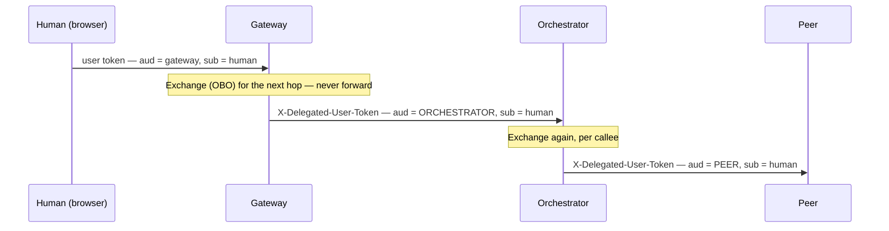

# Act 06 — The Delegated Chain (A Human Rides the Agents)

**Needs:** Act 04 complete, including §6 (OBO enabled). The peer + orchestrator running.

**Goal of this act:** put a human back in — but this time behind the *agents*. You'll take a
real user token, have the orchestrator carry that human's identity to its subagents by
**exchanging** it per hop (never forwarding it), and watch the gateway confirm it still sees
the *human*, not the agent. This is the hardest and most interesting path in the system, and
the one carrying the project's last open question.

---

## 6.1 — Send a human's identity through the orchestrator

First, get a real user token: sign in to the frontend as admin (Act 01), open the Token
Inspector, copy the raw token, and put it in `.env` as `TEST_ADMIN_TOKEN` (it lasts ~1 hour).

Then run the helper script this walkthrough ships:

```bash
uv run python docs/walkthrough/scripts/delegated_dispatch.py
```

What it does (and what you should read it to see): it takes your user token, uses the
**gateway's** `DelegatedTokenExchanger` to OBO-exchange it into a token narrowed for the
**orchestrator**, then calls the orchestrator's `/dispatch` with two headers —
`Authorization: Bearer <the event-trigger agent token>` and
`X-Delegated-User-Token: <the exchanged user token>`.

**Expected output** — the orchestrator now reports a *delegated* principal:

```json
{
  "principal_type": "delegated",
  "acting_agent": "<AGENT_ORCHESTRATOR_CLIENT_ID>",
  "on_behalf_of": "AdeleV@...",
  "subagents": {
    "peer":    { "ok": true, "status": 200, "response": { "principal_type": "delegated", "on_behalf_of": "AdeleV@...", "...": "..." } },
    "gateway": { "ok": true, "status": 200, "response": { "...": "..." } }
  }
}
```

Compare this side by side with Act 05's output. Same chain, same agents, same code — the *only*
difference is that a user token rode along, and that alone flipped `principal_type` from
`machine` to `delegated` and filled in `on_behalf_of`. That's the derived-principal rule paying
off: you didn't configure a mode, you added a token.

---

## 6.2 — The gateway leg sees the human, not the agent

Look at the `gateway` subagent leg. The orchestrator called the gateway's `/me` on the human's
behalf, and `/me` reports whichever principal the *gateway* resolved. It names **the human** —
`AdeleV@…` — even though the immediate caller on the wire was the orchestrator agent.

That's the whole delegation guarantee in one observable fact: three services deep, through two
agent hops, the gateway still correctly attributes the request to the original human. The agent
is the *actor*; the human is the *subject*.

**Read the code:** `orchestrator_agent/server.py` — `_authenticate` derives the principal
(agent claims + optional rider user claims), and `_dispatch_to` calls `build_agent_headers` to
produce the two headers for each callee. The peer's mirror is `peer_agent/server.py`
`_authenticate` / `_call_gateway`.

---

## 6.3 — Decode the exchanged token: narrowed audience, same human

This is the payoff. Take the `X-Delegated-User-Token` the script sent to the orchestrator
(print it from the script, or capture it) and decode it. Compare it to your original token:

| Claim | Your original token | The exchanged token |
|-------|--------------------|--------------------|
| `aud` | the **gateway** app | the **orchestrator** app (`api://<orch>` or bare) |
| `sub` | the human | **the same human** |
| `iss` | your tenant | your tenant |



*(Source: [`assets/token-exchange.mmd`](assets/token-exchange.mmd).)*

Two properties, both visible in that table:

- **`aud` changed** — the token is narrowed to exactly the next callee. A token captured at the
  orchestrator hop can't be replayed at the peer, because its audience names the orchestrator
  and the peer checks audience. This is the anti-replay property, per hop.
- **`sub` did not change** — the human stays the subject through every exchange. The agent
  never *becomes* the user; it acts *for* them. Delegation, not impersonation.

**Read the code:** `agent_common/tokens.py` — `DelegatedTokenExchanger.exchange_for` (the OBO
call that produces the narrowed token), and `agent_common/outbound.py`
`build_agent_headers` — the single place that decides to *exchange* rather than *forward*, with
the reasoning in its docstring.

---

## 6.4 — The open question this act answers: does the exchanged token carry `groups`?

Here is the one thing the project genuinely didn't know until someone ran this on a real tenant
— and now you can settle it. Decode the exchanged user token and look for a **`groups`** claim.

**Why it matters:** the gateway authorizes a *human* by group membership (Gate 1). When the
orchestrator calls the gateway on the human's behalf, the gateway runs the human through
`authorize_human_claims`, which reads `groups`. If the OBO-exchanged token **carries `groups`**,
the delegated call sails through Gate 1. If OBO **drops `groups`**, the gateway sees a
group-less human and denies with `no_group_membership` — and the delegated-through-agents path
is blocked until you fix it.

**Both outcomes, and what to do:**

- **`groups` present** → nothing to do; the delegated chain is complete. Note it in your run
  log so the limitation can be closed.
- **`groups` absent** → the fix is to add the **`groups` optional claim** to the *agent* app
  registrations (the ones minting the exchanged token), so the OBO token carries group
  membership forward. This is a §4-style optional-claim edit, applied to the agent apps.

**Read the code:** `authorize_human_claims` (`a2a_server/server.py:591-628`) is what consumes
`groups` on the delegated leg — the same function the human path uses in Act 02, called here
for the rider token. That reuse is deliberate: if the delegated path had its own ACL, an agent
holding `Agent.Invoke` would become a way around the gateway's group rules for every user.

---

## Architecture decision — exchange per hop, never forward

**What was chosen:** at each hop, the calling agent **exchanges** the inbound user token for a
new one audience-narrowed to the specific callee (`build_agent_headers` → `exchange_for`). It
never forwards the token it received.

**The alternative:** forward the inbound user token unchanged. Simpler — no OBO call, no extra
Entra round-trip per hop.

**Why exchange:** the token the gateway received was minted for the *gateway*. If the gateway
forwarded it to the orchestrator, and the orchestrator forwarded it to the peer, then a single
captured token would be replayable at *every service the gateway can reach* — its audience says
"gateway," and anything that accepts gateway-audience tokens would take it. Exchanging narrows
the audience to exactly one callee at each step, so a captured token is useless one hop over.
It also bounds a compromised callee: it can't walk a user's token any further than the single
hop it was granted.

**The trade-off:** an OBO exchange per hop is a real Entra round-trip (cached per
(user-token, callee) pair to soften it — the `DelegatedTokenExchanger` LRU). More latency and
more moving parts than forwarding a string. You're buying per-hop replay containment for the
cost of a cached token exchange. This is the single most important anti-replay mechanism in the
agent tier, and it's why the "largest open gap" (no mTLS, Act 08) matters less than it would
if tokens were forwarded raw.

---

> ### Checkpoint — Act 06
> **You have now proven:** a human's identity travels through two agent hops as an
> *exchanged*, audience-narrowed token; the principal is `delegated` with the human in
> `on_behalf_of`; the gateway three services deep still attributes the request to the human;
> and you've decoded a token to see `aud` narrow while `sub` stays.
>
> **You now understand:** exchange-not-forward and why it's the anti-replay backbone; delegation
> vs impersonation; and the answer to whether OBO carries `groups` (and the fix if it doesn't).
>
> **Explain it in one sentence:** *"An agent carries a human's identity to the next agent by
> minting a fresh token scoped to just that callee, keeping the human as the subject — so the
> human's identity propagates without any single token being replayable beyond one hop."*

Next: [Act 07 — adversarial](07-adversarial.md). Now try to break every one of these guarantees.
