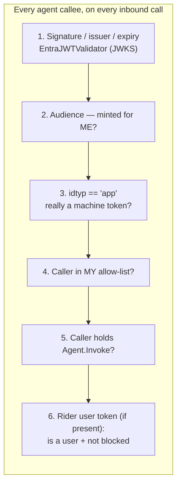

# Act 08 — Orchestration Security: The Full Flow, Synthesized

**Needs:** Acts 01–07 read and, ideally, run. This act has little new to *type* — it's where
everything you've tested becomes one coherent model you can defend on a whiteboard.

**Goal of this act:** assemble the per-hop trust story, map every attack class to the scenario
that proved it's blocked, be honest about what's still open, and hand you the
explain-it-to-others cheat sheet.

---

## 8.1 — The trust table: what every hop independently verifies

Every agent callee, on every inbound call, runs the same sequence — and it runs it itself, not
on the word of the caller.

*(Source: [`assets/trust-per-hop.mmd`](assets/trust-per-hop.mmd).)*

Laid out across the two chains you built:

| Check | Human path (Gate 1, gateway) | Machine / delegated path (each agent hop) | Code |
|-------|------------------------------|-------------------------------------------|------|
| Signature / issuer / expiry | `TokenValidator.validate` | `EntraJWTValidator.validate` | `a2a_server/server.py`, `agent_common/jwt_validator.py` |
| Audience minted for me | (gateway audience) | `_audience_matches` + validator | `agent_common/principal.py`, `jwt_validator.py` |
| Machine vs human | `is_app_token` fork | `is_app_token` | `agent_common/principal.py:45` |
| Caller is known | group membership | `allowed_callers_for` | `a2a_server/server.py`, `agent_common/registry.py` |
| Caller is authorized | allowed group | `Agent.Invoke` app role | `verify_agent_claims` |
| Rider user is real + allowed | n/a (they *are* the user) | `verify_delegated_user` | `agent_common/principal.py:152` |
| Blocklist | `authorize_human_claims` | `verify_delegated_user` (every hop) | both |

The point of the table: there is no row that one hop does and another skips because "an earlier
hop already checked." The blocklist is checked at the gateway *and* at every agent hop, against
each hop's own copy of `BLOCKED_USERS`. Duplicated on purpose — no hop trusts a hop it cannot
see.

---

## 8.2 — Threat model: each attack → the scenario that proved it blocked

| Attack class | What the attacker tries | Blocked by | Proven in |
|--------------|------------------------|------------|-----------|
| **Cross-hop replay** | reuse a token from hop N at hop N+1 | per-hop audience narrowing; validator checks `aud` | Act 07.1 (401) + Act 06.3 (aud narrows) |
| **Fabricated human** | app-only token in the user slot to invent a human | `verify_delegated_user` → `is_app_token` guard | Act 07.2 (403 `delegated_token_not_a_user`) |
| **Privilege self-grant** | agent presents a `groups` claim to grab a role | machine role from app id only, group claims ignored | Act 05.3 / design (get_agent_roles) |
| **Raw-token forwarding** | a captured token replayable everywhere the gateway reaches | exchange-not-forward (`build_agent_headers`) | Act 06 (exchange) + 07.1 (replay fails) |
| **Downgrade on failed exchange** | make a delegated call silently proceed as machine | a failed exchange is a *failure*, not a fallback | Act 07 design (fail-closed) |
| **Uninvited caller** | a genuine agent calls one it's not allowed to | call-graph allow-list | Act 07.3 (403 `unknown_agent`) |
| **Outright forgery** | `alg=none`, HS256 key-confusion | signature-first, RS256-pinned, JWKS | Act 07.4 (tests pass = forgeries rejected) |
| **Human blocklist bypass via agent** | route a blocked user through an agent | blocklist re-checked at every hop | Act 06.4 / Act 02.1 |

If you can walk this table out loud, pointing at the scenario that demonstrates each row, you
understand the system's security model as well as anyone who built it.

---

## 8.3 — What's honestly still open

A walkthrough that only shows strengths is marketing. These are the real gaps, all documented
in `CLAUDE.md` and `HANDOFF.md`:

- **No mTLS between agent hops — the largest open gap.** Agent-to-agent calls run over plain
  HTTP. A rogue process that squats a callee's port could harvest bearer tokens and replay them
  at the real callee. Per-hop audience narrowing *limits* the blast radius (a harvested token is
  only good for that one callee), which is exactly why narrowing matters so much while this is
  open. Closed in Phase 2 with the certs you already generated.
- **MCP shares the gateway's app registration** (Act 03.4). Per-hop narrowing stops one hop
  short of the MCP server. Confused-deputy gap, predates the agent work, Phase 2 fix is MCP's
  own registration.
- **Plain HTTP everywhere in the mesh** — no transport encryption locally. Fine for a laptop
  testbed, not for anywhere real.
- **No rate limiting** — nothing throttles a caller hammering a hop.
- **Two JWT validators** — the gateway's multi-IdP `TokenValidator` (no JWKS TTL) and
  `agent_common/jwt_validator.py` (Entra-only, has a TTL). They differ in behaviour, not just
  code; don't assume one when reading the other.
- **Integration tests written but (as of this walkthrough) never run against a live tenant** —
  Act 07.5 is where that changes.

None of these is hidden; the value of writing them down is that the next person doesn't discover
them as a surprise.

---

## 8.4 — The six load-bearing rules (the cheat sheet)

These are from `CLAUDE.md`'s **Multi-Agent Identity** section. Each is a rule that must not be
quietly relaxed; each maps to a code location and to a scenario you ran. This is the thing to
memorize for explaining the system.

| # | Rule | Where | You saw it in |
|---|------|-------|---------------|
| 1 | **Signature first, claims second.** `azp`/`roles`/`aud` are attacker strings until the JWT is verified. | `jwt_validator.py:89` | Act 07.4 |
| 2 | **`is_app_token()` fails closed.** Reads `idtyp=="app"` and nothing else; missing → refuse. No "no username, therefore machine" fallback. | `principal.py:45` | Act 04 §4, Act 05.3 |
| 3 | **Machine role resolution ignores group claims.** An app controls its own claims, so a group-promotable agent could grant itself any role. | `policy.py get_agent_roles` | Act 05.3 |
| 4 | **A failed token exchange is a failure, not a fallback.** Proceeding without the user token silently downgrades the hop to machine. | `outbound.py`, `orchestrator ._dispatch_to` | Act 07 design |
| 5 | **Build outbound headers with `build_agent_headers()`.** Don't hand-roll the two-header contract in a new caller. | `outbound.py` | Act 06 |
| 6 | **Authenticate before parsing the body.** An unauthenticated request never reaches a parser. | orchestrator/peer `dispatch`/`invoke` | Act 07 (all attacks refused pre-parse) |

---

## Architecture decision — the whole trust model, and where its edges are

**What was chosen:** a first-party mesh where identity (human or agent) is a signed token
re-verified independently at every hop, principal type is derived from tokens present, authority
comes from an out-of-band source the caller can't influence (human groups; agent app-id role),
and every hop narrows what it hands onward.

**The alternative:** a perimeter model — authenticate hard at the edge, trust the interior. Or a
mesh with mutual TLS as the *only* identity (the network proves who you are).

**Why this model:** the requirement is that *a specific human's identity* reaches the tool and
the resource, through agents, with per-user authorization decisions at each gate — and that a
compromise of any one component doesn't cascade. A perimeter model fails the cascade requirement
(interior trust is a single point of failure). mTLS-as-identity proves *which service* is
calling but carries no *user* identity and no audience/expiry semantics, so it can't make the
per-user decisions this system exists for. Token-based per-hop verification carries the user,
narrows per hop, and re-checks everywhere.

**Where its edges are:** the model *assumes* a closed set of known callers (the registry) and a
shared trust in the same IdP(s). It is not built to onboard untrusted third-party callers (that's
the OAuth/DCR world from Act 03.3). And it currently leans on audience narrowing to compensate
for the absence of transport security (no mTLS yet) — which is a coherent Phase-1 position
precisely *because* narrowing is real and tested, but it's a position with a known expiry date:
Phase 2's mTLS is what lets the model stop depending on "a harvested token is only good for one
hop" and start depending on "you can't harvest it in the first place."

---

> ### Checkpoint — Act 08
> **You have now assembled:** the per-hop trust table, the threat-model mapping, the honest
> open-gaps list, and the six-rule cheat sheet.
>
> **You now understand:** the complete model well enough to defend each decision and name each
> limitation without looking it up.
>
> **Explain it in one sentence:** *"It's a closed mesh where a signed identity is re-verified and
> re-narrowed at every hop, authority can't be self-granted, and the one thing holding the line
> until mTLS ships is that a stolen token is only ever valid for a single next hop."*

Next: [Act 09 — the second IdP, Cognito](09-cognito.md). Optional, and last.
